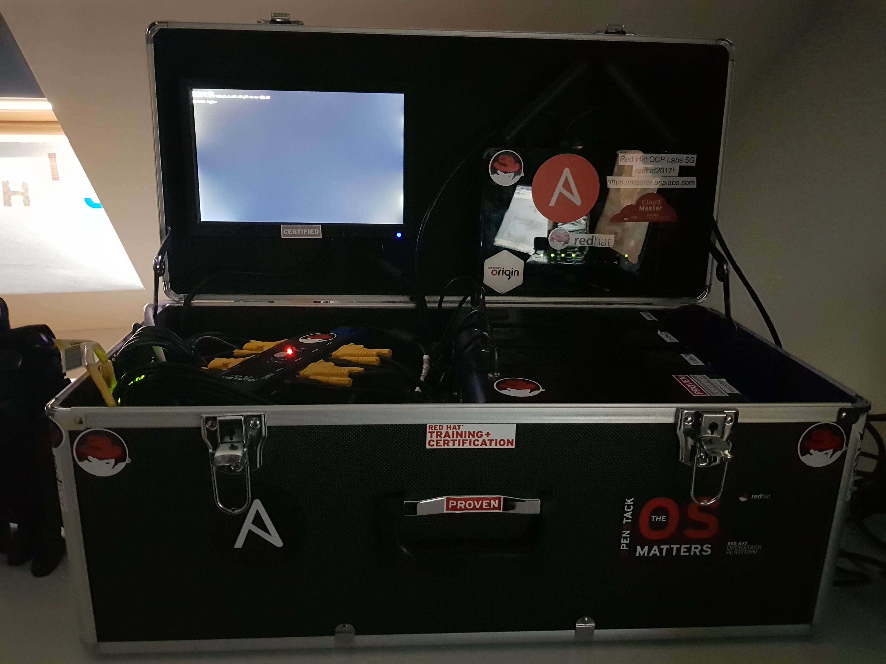

# Setting up an OpenShift 4 Lab cluster via Ansible

## Introduction
This document described how to install a [Red Hat OpenShift 4](https://www.redhat.com/en/openshift-4) Cluster on a Lab environment.

The lab environment consists of the following parts:

- 4 Bare-Metal machines with 16 GB RAM and 2x SSDs (128 GB and 256 GB) each
- 1 Bastion host with 4 GB RAM and 2x SSDs (250 GB and 500 GB)
- 1 Gigabit Switch
- 1 WLAN-Router
- 1 KVM switch
- 1 LCD-Panel
- USB keyboard and mouse connected to KVM switch
- 1 toolbox (to contain the lab)



## Steps
### Setup WLAN router
The WLAN router needs to have the following configuration settings:

- Disable DHCP (this will be done via the *Bastion* host later)
- Define the following DNS servers
	- 8.8.8.8
	- ```<IP of Bastion Host>```
	
### Setup BIOS
In order for automation to work you need to configure the BIOS of the master and worker nodes to use the following features:

- Boot from Ethernet device
- Wake-On-LAN (usually hidden in ACPI settings)

### Setup Bastion host
Create a *Bastion* host with **Red Hat Enterprise Linux 8.1** (or higher) and use subscription-manager to entitle the system.

Also you need to install *Ansible* via
```yum install -y ansible```

### Get IP/MAC-Addresses
For creating the *Ansible* inventory file you will need to define IP addresses for the masters, workers, and bootstrap node.

### Get an offline access token
Go to https://cloud.redhat.com/openshift/token and request an offline access token. This is needed later for requesting the pull secrets for mirroring container images.

### Create inventory file
Now create an *Ansible* inventory file named *ocp4labs-inventory* with the following content (adjust as you see fit):
```
[ocp4labs:children]
bastion
kvm
masters
workers
bootstrap

[ocp4labs:vars]
host_key_checking = False
ansible_ssh_private_key_file=~/.ssh/id_ocplabs
ansible_ssh_user=root
ocp4_release=4.3.3
ocp4_release_name=ocp-release
ocp4_type=bare-metal
ocp4_cluster_name=<cluster-name>
ocp4_cluster_domain_name=<cluster-domain-name>
rhcos_release=4.3.0

# Taken from https://cloud.redhat.com/openshift/token
ocp4_offline_access_token=<offline-access-token>

[all]
master01 ansible_host=<node-ip> ethernet="<node-mac>" kvm_host=kvm01
master02 ansible_host=<node-ip> ethernet="<node-mac>" kvm_host=kvm02
master03 ansible_host=<node-ip> ethernet="<node-mac>" kvm_host=kvm03
worker01 ansible_host=<node-ip> ethernet="<node-mac>" kvm_host=kvm01
worker02 ansible_host=<node-ip> ethernet="<node-mac>" kvm_host=kvm02
worker03 ansible_host=<node-ip> ethernet="<node-mac>" kvm_host=kvm03
bastion ansible_host=<node-ip> ethernet="<node-mac>"

[bastion]
bastion

[kvm]
kvm01
kvm02
kvm03

[masters]
master01
master02
master03

[workers]
worker01
worker02
worker03

[bootstrap]
worker01
```
### Create SSH keys

ssh-keygen -f ~/.ssh/id_ocplabs

cat ~/.ssh/authorized_keys
<Content of ~/.ssh/id_ocplabs.pub>

cat ~/.ssh/config 
IdentityFile ~/.ssh/id_ocplabs

### Run Ansible playbook
Now you are ready to run the *Ansible* playbook as follows:

```ansible-playbook -vvv -i ocp4labs-inventory ocp4labs.yml```

Depending on the hardware available and speed of the internet connection this may take a while, so grab a coffee or cook yourself a good meal. Soon you will have a fully functional OpenShift 4 Cluster up-and-running to play around with.
